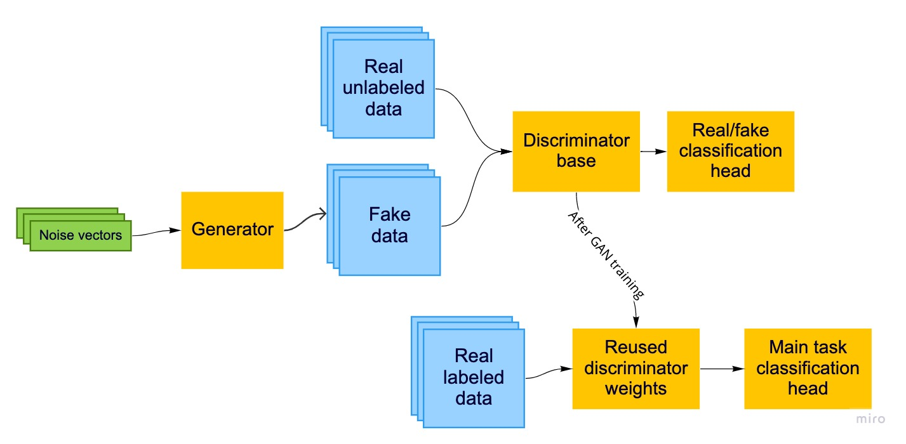

<div align="center">
  <h1>GAPNet</h1>

<p align="center">

<a href="https://github.com/connor-mccarthy/gapnet/workflows/build/badge.svg">
    
</a>
<a href="https://img.shields.io/badge/python-3.8.10-blue.svg">
    
</a>
<a href="https://img.shields.io/badge/code%20style-black-000000.svg">
    
</a>
  <h4><b>G</b>enerative <b>A</b>dversarial <b>P</b>re-training <b>Net</b>work for Few-shot Classification Tasks</h4>
</div>

This repo contains the code I used to investigate a model training hypothesis I'm calling GAPNet. I was hopeful the GAPNet training strategy might provide a boost in classification accuracy when you have an abundance of unlabeled examples but few labeled examples. My hypothesis _was wrong_, but here's the basic training procedure anyway:

1. Train a GAN on the abundant unlabeled dataset
2. Take the learned discriminator from the GAN and chop off its classification head
3. Apply a new classification head to the discriminator for the primary classification task, creating a new classifier with a particular weight initialization from the GAN's discriminator
4. Re-train the new classifier for the primary classification task



This hypothesis was inspired by and a re-applies some of the principles described in existing papers on semi-supervised deep learning, including [Improved Techniques for Training GANs](https://arxiv.org/abs/1606.03498) and [GAN-BERT](https://www.aclweb.org/anthology/2020.acl-main.191.pdf). Both papers propose jointly training a discriminator and the main task classifier. By contrast, GAPNet trains a discriminator then main classifier sequentially.

### Findings

GAPNet didn't work! Bummer.

I tested my hypothesis about GAPNet a deep convolutional GAN ([DCGAN](https://arxiv.org/abs/1511.06434)). I trained the GAN on 45,000 unlabeled training samples from MNIST, then trained the classifier (reusing initial weights from the GAN discriminator) on only 20 labeled MNIST examples. I tested the classifier on a test set of 10,000 samples.

I compared this model to a classifier with the same architecture, but trained on only the same 20 labeled MNIST examples. I tested on the same 10,000 sample test set.

| Methodology | Crossentropy Loss | Accuracy |
| ----------- | ----------------- | -------- |
| Baseline    |                   |          |
| GAPNet      |                   |          |

### Reproducing results

```python
python -m venv .venv
source .venv/bin/activate
pip install -r requirements.txt
python src/main.py
```
